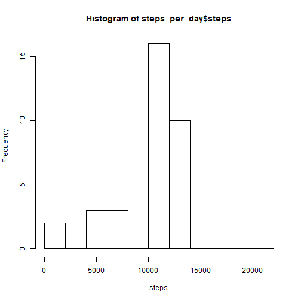
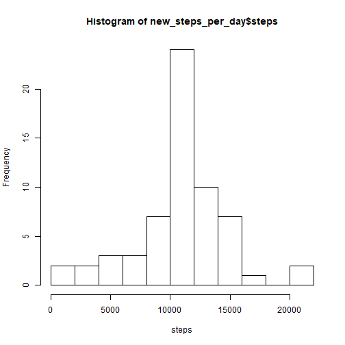
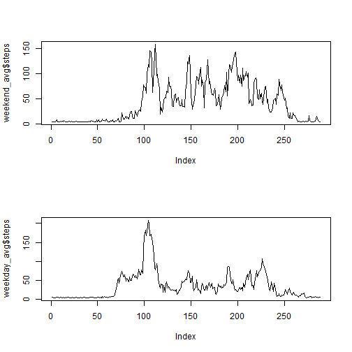

##Reproducible Research
### Course Project 1 


Dataset Used is: *Activity Monitoring Data* 

The variables included in this dataset are:

- **steps:** Number of steps taking in a 5-minute interval (missing values are coded as NA)
- **date:** The date on which the measurement was taken in YYYY-MM-DD format
- **Interval:** Identifier for the 5-minute interval in which measurement was taken

The dataset is stored in a comma-separated-value (CSV) file and there are a total of 17,568 observations in this dataset.

**Loading and preprocessing the data**

The file "Activity.csv"is read and loaded. 


```r
activity_data <- read.csv(file="activity.csv", header = TRUE)
```
**What is mean total number of steps taken per day?**

The total number of steps taken per day: 


```r
steps_per_day <- aggregate( steps~date, data = activity_data, FUN=sum)
```

plot a histogram


```r
hist(steps_per_day$steps, breaks=10, xlab="steps")
```



The mean and median of the total number of steps taken per day:


```r
mean_of_steps <- mean(steps_per_day$steps)
median_of_steps <- median(steps_per_day$steps)
```
The mean is 1.0766189 &times; 10<sup>4</sup> and the median is 10765. 

**What is the average daily activity pattern?**

Plot of of the 5-minute interval (x-axis) and the average number of steps taken, averaged across all days (y-axis):


```r
avg_per_interval <- aggregate(steps~interval, data=activity_data, FUN=mean)

plot(x=avg_per_interval$interval, y=avg_per_interval$steps, type="l", xlab="Interval", ylab="Average Steps")
```


The 5-minute interval, on average across all the days in the dataset which contains the maximum number of steps is 


```r
max_step <- which.max(avg_per_interval$steps)
max_steps_interval <- avg_per_interval[max_step,1] 
```
interval with maximum number of steps: 835

**Imputing missing values**

To calculate total number of missing values in the dataset

```r
missing_values <- sum(!(is.na(activity_data$steps)))
```

A new data-set is created from the old data-set and the missing values are imputed 


```r
new_activity_data <- activity_data
new_activity_data$steps[is.na(activity_data$steps)] <- mean(activity_data$steps, na.rm=TRUE)
```

The new data set *new_activity_data* does not have missing values in it. 

A histogram is plotted with the new data set similar to the old date set and mean/median is calculated to see the impact.


```r
new_steps_per_day <- aggregate( steps~date, data = new_activity_data, FUN=sum)

hist(new_steps_per_day$steps, breaks=10, xlab="steps")
```



```r
new_mean_of_steps <- mean(new_steps_per_day$steps)
new_median_of_steps <- median(new_steps_per_day$steps)

diff_mean_of_steps <- mean_of_steps - new_mean_of_steps
diff_median_of_steps <- median_of_steps - new_median_of_steps
```
The new mean value is 1.0766189 &times; 10<sup>4</sup> and the new median value is 1.0766189 &times; 10<sup>4</sup>. 

A small impact is created. 

**Are there differences in activity patterns between weekdays and weekends?**

A new factor variable is created with two levels: "Weekday" and "Weekend".


```r
weekdays <- c("Monday", "Tuesday", "Wednesday", "Thursday","Friday")
new_activity_data$day <- as.factor(ifelse((weekdays(as.Date(new_activity_data$date))) %in% weekdays, "Weekday", "Weekend"))
```

A panel-plot is created with values averaged across all weekdays and weekends.


```r
avg_per_interval_weekday <- aggregate(steps~interval + day, data=new_activity_data, FUN=mean)

weekday_avg <- subset(avg_per_interval_weekday, day=="Weekday")
weekend_avg <- subset(avg_per_interval_weekday, day=="Weekend")

par(mfrow = c(2, 1))
plot(weekend_avg$steps, type="l")
plot(weekday_avg$steps, type="l")
```




